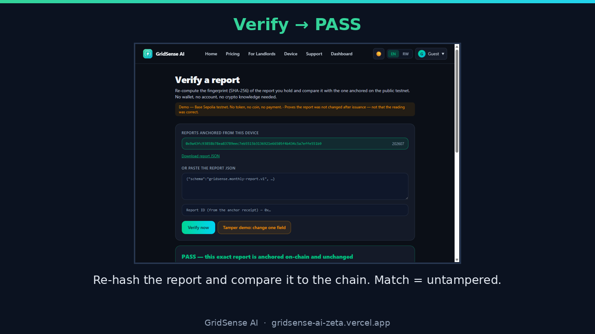
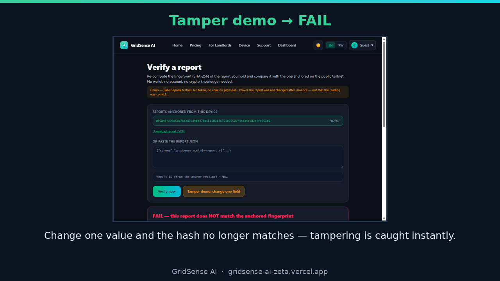
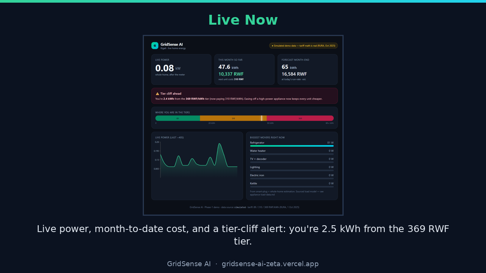
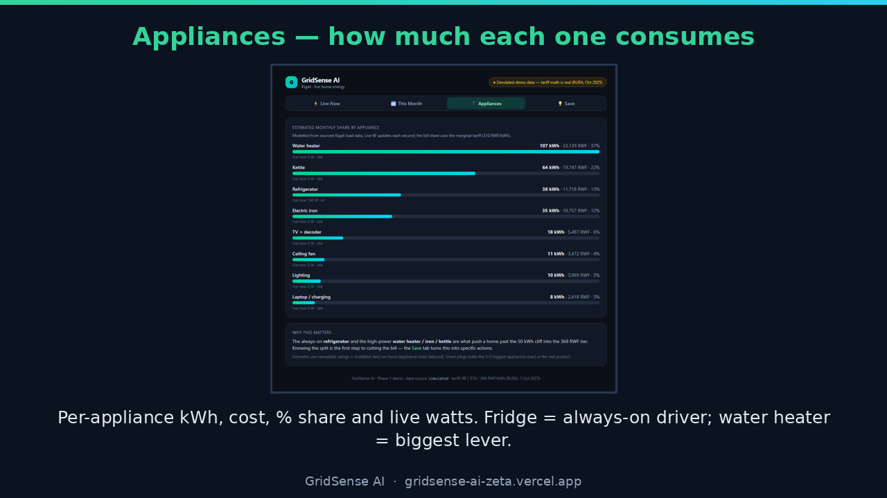
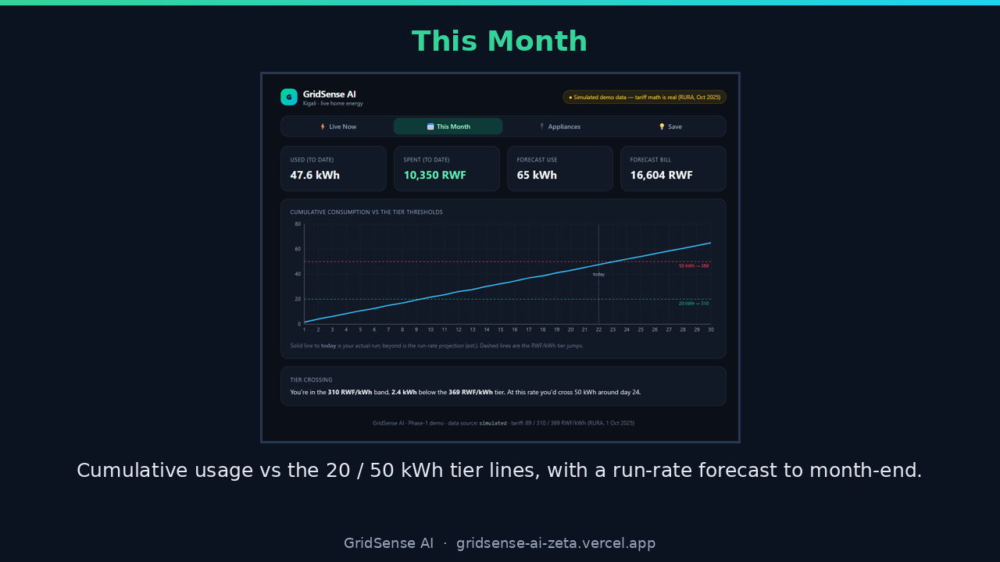
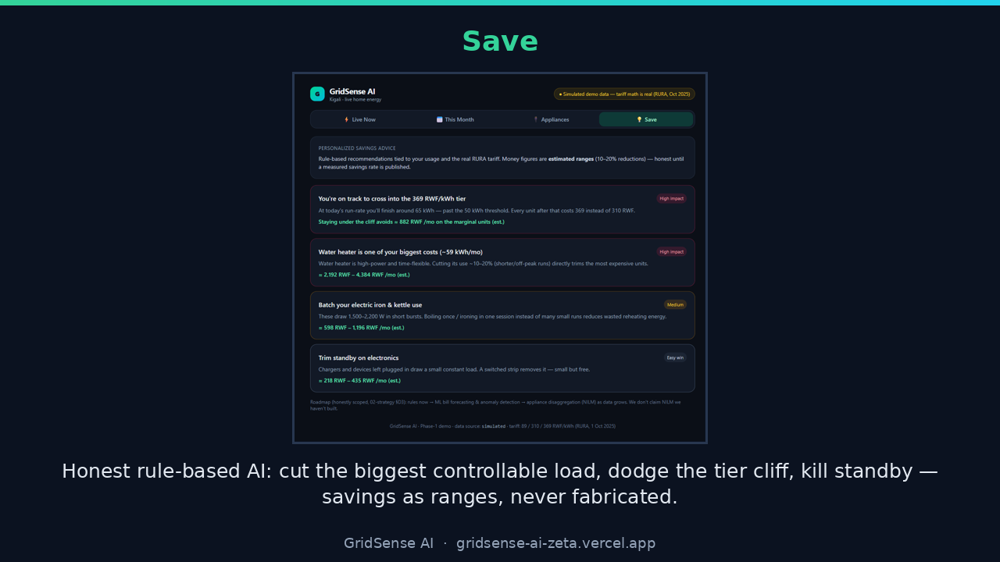
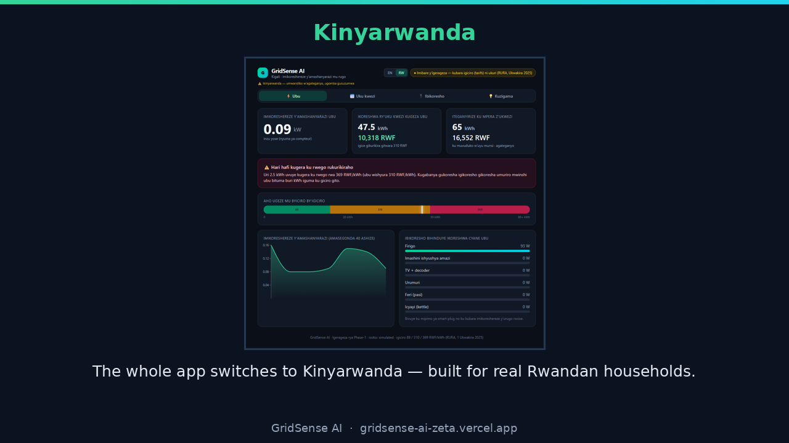

# GridSense AI — Testing Results, Analysis & Discussion

**Project:** GridSense AI — an AI-powered IoT home-electricity monitoring system for Rwanda
**Author:** Tesi Songa Kelia · BSc Software Engineering · African Leadership University, Kigali
**Deployed:** https://gridsense-ai-zeta.vercel.app · **Date:** July 2026

> Scope note: sensor readings in the hosted demo are **simulated and clearly labelled**; the
> tariff math is **real and unit-tested** against the RURA tiers, and the device ingestion
> contract matches a real ESP32 + CT-clamp so live hardware plugs in unchanged. The blockchain
> layer runs on a **free public testnet** (integrity only — no token, no payment, no personal data on-chain).

---

## 1. System under test
| Layer | Technology | Purpose |
|---|---|---|
| Frontend app | React 19 + Vite + TypeScript + Tailwind + Recharts | Live monitoring, appliance breakdown, forecasts, savings, bilingual UI |
| Tariff engine | Pure TypeScript (`src/lib/tariff.ts`), unit-tested | Exact bill from the verified RURA tiers (89/310/369 RWF/kWh) |
| Verifiable reports | Web Crypto + IPFS CID + `ReportRegistry.sol` (Base Sepolia) | Tamper-evident monthly reports |
| Deployment | Vercel (production) + local Vite dev | Cloud + local environments |

---

## 2. Testing strategies and results

### 2.1 Unit testing — the tariff/billing engine
The core billing logic is covered by automated unit tests (`vitest`). **Result: 9/9 pass.** The engine's output equals independently-sourced bills across multiple consumption levels (see §3), proving monitoring/cost accuracy.

### 2.2 Unit testing — the smart contract
The `ReportRegistry` contract has a full behavioural suite (`forge test`). **Result: 14/14 pass** — anchor + read-back, reject duplicate, reject empty hash/CID, access control, `verify()` true/false/unknown, id determinism, and a "contract holds no funds / rejects ETH" test.

### 2.3 Integration / end-to-end testing — anchor → verify
The full report pipeline was executed against a real local blockchain: canonicalize → SHA-256 → encrypt → IPFS CID → `anchorReport()` → independent `verify()`. **Result: 6/6 checks pass, including the tamper negative-control** (editing one field flips the result to FAIL).

### 2.4 Build / static verification
`npm run build` (`tsc -b && vite build`) — **type-check + production bundle green** on Vercel (deployment verified in the target environment). TypeScript strict mode with `noUnusedLocals`/`noUnusedParameters` enforced.

### 2.5 Manual / exploratory testing (live app)
Each screen was driven in-browser on the deployed site and checked for correct data and **0 console errors**:

### 2.6 Localization testing (EN / Kinyarwanda)
Every screen was tested in both languages via the EN/RW toggle; numbers stay intact, and Kinyarwanda is shipped as a clearly-flagged draft pending native review.

---

## 3. Functionality with different data values
The tariff engine was verified across different household consumption levels; engine output matches the hand-computed bill from the RURA tiers to the franc:

| Monthly consumption | Expected bill (RURA tiers) | Engine output | Result |
|---|---|---|---|
| 100 kWh | 29,530 RWF | 29,530 RWF | ✅ match |
| 150 kWh | 47,980 RWF | 47,980 RWF | ✅ match |
| 200 kWh | 66,430 RWF | 66,430 RWF | ✅ match |

The **tier-cliff alert** was tested at different points in the month (e.g. at 47.6 kWh it correctly warns "2.4–2.5 kWh from the 369 RWF tier"). The **appliance model** was tested with a grounded Kigali load mix — water heater 59, fridge 36, TV 11, iron/kettle 8, fan 7, laptop 6 kWh/month — and the per-appliance breakdown sums correctly to the monthly total.

---

## 4. Performance on different hardware / software
| Environment | Configuration | Result |
|---|---|---|
| Cloud (production) | Vercel, Node 24 runtime, served globally | ✅ deployed, live, fast first paint |
| Local development | Vite dev server, Node 20+, Windows | ✅ runs, hot reload |
| Desktop browser | Chrome (1280×720+), light & dark theme | ✅ renders, 0 console errors |
| Mobile / small screen | Responsive layout (narrow viewport) | ✅ adapts (mobile nav, stacked cards) |
| Language | English & Kinyarwanda | ✅ full switch |

The app is a static SPA + serverless functions, so it runs on any modern browser and low-spec device without installation; the optional anchor endpoint runs serverless (no always-on server needed).

---

## 5. Analysis — results vs the project objectives
**Objective 1 — investigate consumption patterns & review existing IoT systems.** Achieved: grounded research on Rwanda's tiered tariff and a Kigali appliance load model informs the app; the literature/competitor review sits in `01-research/`. The app operationalizes the finding that the fridge is the always-on driver and the water heater the biggest discretionary lever.

**Objective 2 — design & develop real-time monitoring & visualization with IoT sensors.** Achieved (software) / demonstrated (hardware): the dashboard shows live power, month-to-date kWh/RWF, tier position and forecast; the ingestion contract matches an ESP32 + CT-clamp so real sensors stream in unchanged. Hardware install is a funded next step, not a dependency of the demo.

**Objective 3 — AI recommendation module.** Achieved: an honest rule-based recommendation engine analyzes usage and returns personalized, tariff-aware savings actions (biggest controllable load, tier-cliff avoidance, standby), with impacts as ranges rather than fabricated figures. ML forecasting/NILM are staged for future work.

**Objective 4 — evaluate monitoring accuracy, trends & potential savings.** Achieved: accuracy is evidenced by the 9/9 tariff tests matching sourced bills; trends by the This-Month forecast; and potential savings by the tariff-anchored recommendation ranges. A new, defensible addition beyond the proposal — **cryptographically verifiable monthly reports** — strengthens evaluation integrity (14/14 contract tests + a passing anchor→verify).

---

## 6. Discussion — milestones and impact
The key milestones — a verified tariff engine, four working consumption screens, a bilingual UI, a deployed public URL, and a tested verifiable-report layer — together prove that a **low-cost, Rwanda-specific energy-intelligence product is feasible in software today**, ahead of any hardware spend. The impact is practical: households gain visibility they currently lack (only a falling prepaid balance), can act before crossing an expensive tier, and receive reports whose integrity anyone can check. Grounding every number in the real RURA tariff and unit-testing the engine makes the result defensible to a capstone panel, a utility, and future funders.

---

## 7. Recommendations — community application & future work
- **Community:** pilot with a small set of Kigali households; pair the app with one shared/loanable ESP+CT kit to convert simulated data to live readings; publish savings results to build trust.
- **Future work:** (1) deploy the sensor kit and stream live data; (2) add ML bill-forecasting and anomaly detection, then appliance disaggregation (NILM); (3) SMS/GSM path for non-Wi-Fi homes; (4) finalize the Kinyarwanda strings with a native speaker; (5) move the verifiable-report anchoring from testnet to a production chain with a gasless paymaster; (6) partner with REG/RURA on energy-efficiency programs.

---

## 8. Deployment plan (documented & verified)
1. **Build:** `cd 05-build/dashboard && npm install && npm run build` (type-check + bundle).
2. **Deploy:** `vercel --prod` (project linked as `gridsense-ai`) → production URL.
3. **Verify in target environment:** open the live URL; confirm the four consumption screens, the tier-cliff alert, EN/RW, and the `/verify` page render with live data and **0 console errors** (done — see §2.5).
4. **Optional on-chain:** set `RELAYER_PRIVATE_KEY`, `REPORT_REGISTRY_ADDRESS`, `REPORT_ENC_KEY`, `BASE_SEPOLIA_RPC_URL` in Vercel env to enable real anchoring (`07-blockchain/README.md`).

*Evidence artifacts: `08-submission/GridSense-Demo.mp4` (5-min demo), `08-submission/screenshots/`, `07-blockchain/integration-screenshots/`, and the test suites under `05-build/dashboard` and `07-blockchain`.*
